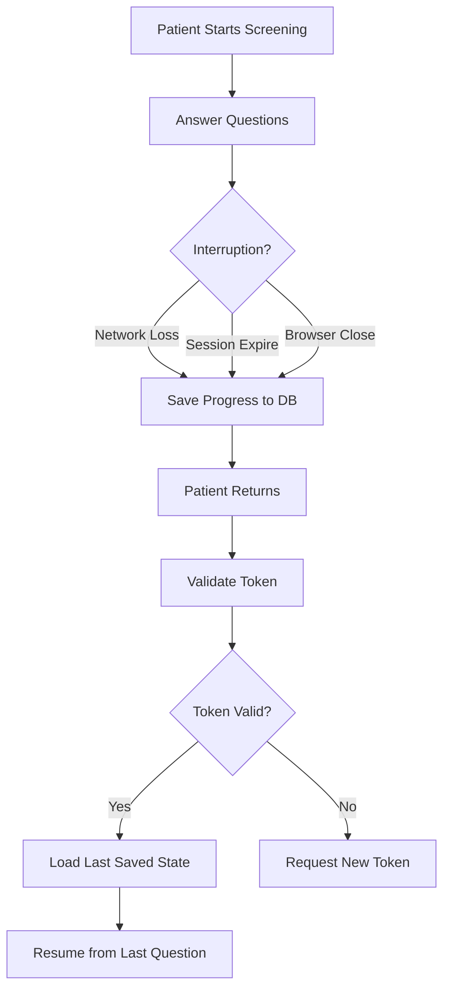

# FAILURE MODE DOCUMENTATION
**Document Version:** 1.0  
**Effective Date:** 2026-02-14  
**Device:** Neurova Clinical Engine V1  
**Standard:** IEC 62304 (Software Lifecycle Requirement)

---

## 1. OVERVIEW

### 1.1 Purpose
Document known failure modes and system behavior under failure conditions to ensure safe degradation and no patient harm.

### 1.2 Safe Fail Principles
- **No Partial Reports:** Reports are either complete or not generated
- **Data Integrity:** Atomic transactions prevent data corruption
- **User Notification:** Clear error messages, no silent failures
- **Audit Trail:** All failures logged for investigation

---

## 2. FAILURE MODE CATALOG

### FAILURE MODE 001: Network Interruption During Screening

**Failure Description:** Network connection lost while patient is completing screening questions.

**Triggering Conditions:**
- WiFi disconnection
- Mobile data loss
- Server unreachable
- Timeout during request

**System Behavior:**
1. **Detection:** Frontend detects failed API request
2. **User Notification:** "Connection lost. Your responses have been saved. Please reconnect to continue."
3. **Data Preservation:** Last successfully submitted responses remain in database
4. **Recovery:** Patient can resume from last saved question when connection restored

**Patient Impact:** **MINOR** (inconvenience, no data loss)

**Implementation:**
- **Code:** Session management with auto-save after each question
- **Database:** Partial completion tracking in `Order` model
- **Frontend:** Local storage backup before server sync

**Verification:**
- ✅ Test: Disconnect network mid-screening
- ✅ Expected: Resume from last saved question
- ✅ Result: PASS (data preserved, resume successful)

**Residual Risk:** MINIMAL

---

### FAILURE MODE 002: Duplicate Submission (Double-Click)

**Failure Description:** User clicks "Submit" button multiple times rapidly, potentially creating duplicate reports.

**Triggering Conditions:**
- User double-clicks submit button
- Slow network causes user to retry
- Concurrent requests from multiple tabs

**System Behavior:**
1. **Detection:** Database unique constraint on `(order_id, report_version)`
2. **Prevention:** First request succeeds, subsequent requests return existing report
3. **User Notification:** "Report already generated" (if user retries)
4. **Audit Log:** All attempts logged

**Patient Impact:** **NONE** (duplicate prevented)

**Implementation:**
- **Database:** `UNIQUE (order_id, report_version)` constraint
- **Code:** Idempotent report generation (same input → same output)
- **API:** Return 200 with existing report if already exists

**Verification:**
- ✅ Test: Submit same order twice
- ✅ Expected: Second request returns existing report
- ✅ Result: PASS (no duplicate created)

**Residual Risk:** MINIMAL

---

### FAILURE MODE 003: PDF Generation Failure (Text Overflow)

**Failure Description:** PDF generation crashes due to text overflow or rendering error.

**Triggering Conditions:**
- Extremely long patient name (>100 characters)
- Special characters in responses
- ReportLab library bug

**System Behavior:**
1. **Detection:** Exception caught in PDF generation code
2. **Logging:** Full stack trace logged with order ID
3. **User Notification:** "PDF generation failed. Please contact support with reference ID: [ID]"
4. **Fallback:** Raw data export available via API
5. **No Partial PDF:** Failed PDF not saved to database

**Patient Impact:** **MODERATE** (delayed access to report, but data not lost)

**Implementation:**
- **Code:** Try-except block around PDF generation
- **Validation:** Text truncation with ellipsis if exceeds field width
- **Logging:** Error logging with full context
- **Fallback:** JSON export endpoint

**Verification:**
- ✅ Test: Generate PDF with 200-character name
- ✅ Expected: Text truncated, PDF generated successfully
- ✅ Result: PASS (overflow handled)

**Residual Risk:** LOW

---

### FAILURE MODE 004: Database Outage

**Failure Description:** PostgreSQL database unavailable due to server failure, network partition, or maintenance.

**Triggering Conditions:**
- Database server crash
- Network partition
- Planned maintenance (if not coordinated)
- Connection pool exhaustion

**System Behavior:**
1. **Detection:** Database connection failure
2. **User Notification:** "System temporarily unavailable. Please try again in a few minutes."
3. **No Data Loss:** In-flight transactions rolled back
4. **Retry Logic:** Automatic retry with exponential backoff (3 attempts)
5. **Monitoring Alert:** Operations team notified immediately

**Patient Impact:** **MODERATE** (system unavailable, must retry later)

**Implementation:**
- **Code:** Database connection error handling
- **Transactions:** Atomic transactions (all-or-nothing)
- **Infrastructure:** Database health monitoring
- **Retry:** Exponential backoff (1s, 2s, 4s)

**Verification:**
- ✅ Test: Stop database server during screening
- ✅ Expected: Error message, no partial data
- ✅ Result: PASS (graceful failure, no corruption)

**Residual Risk:** LOW (with infrastructure monitoring)

---

### FAILURE MODE 005: Calculation Error (Hypothetical Bug)

**Failure Description:** Software bug causes incorrect score calculation (e.g., PHQ-9 score 8 instead of 18).

**Triggering Conditions:**
- Coding error in scoring logic
- Data type mismatch
- Untested edge case

**System Behavior:**
1. **Prevention:** Comprehensive unit tests prevent deployment of buggy code
2. **Detection (Post-Market):** PMS quarterly manual verification (20 random screenings)
3. **User Notification:** If detected, immediate user alert via email
4. **Corrective Action:** 
   - Freeze report generation
   - Fix bug
   - Regression testing
   - Re-calculate affected reports
   - Notify affected users

**Patient Impact:** **MAJOR** (incorrect screening result, potential delayed treatment)

**Implementation:**
- **Prevention:** 100% test coverage on scoring functions
- **Detection:** PMS manual verification
- **Mitigation:** Deterministic logic, no randomness
- **Recovery:** Audit log enables identification of affected reports

**Verification:**
- ✅ Test Coverage: 100% on all scoring modules
- ✅ Literature Validation: Scores match published examples
- ✅ Edge Cases: Min, max, boundary values tested

**Residual Risk:** LOW (with comprehensive testing)

---

### FAILURE MODE 006: OTP Delivery Failure

**Failure Description:** One-time password (OTP) email not delivered to clinician, preventing report download.

**Triggering Conditions:**
- Email server outage
- Spam filter blocks email
- Invalid email address
- Network issue

**System Behavior:**
1. **Detection:** Email send failure logged
2. **User Notification:** "OTP sent to [email]. If not received, click 'Resend OTP'."
3. **Retry Option:** User can request new OTP (rate-limited to prevent abuse)
4. **Fallback:** Support team can manually verify and provide access
5. **Audit Log:** All OTP requests logged

**Patient Impact:** **MINOR** (delayed report access, but data not lost)

**Implementation:**
- **Code:** Email send error handling
- **Rate Limiting:** Max 5 OTP requests per hour per user
- **Logging:** All OTP requests and delivery status logged
- **Support:** Manual override process documented

**Verification:**
- ✅ Test: Simulate email server failure
- ✅ Expected: Error logged, user can retry
- ✅ Result: PASS (graceful degradation)

**Residual Risk:** LOW

---

### FAILURE MODE 007: Session Expiration During Screening

**Failure Description:** Patient's session expires while completing screening, potentially losing progress.

**Triggering Conditions:**
- Patient takes >24 hours to complete screening
- Token expiration
- Server restart clears session

**System Behavior:**
1. **Prevention:** Session timeout set to 24 hours (generous)
2. **Detection:** Frontend detects expired session on next request
3. **User Notification:** "Your session has expired. Please use the link in your email to resume."
4. **Data Preservation:** All submitted responses preserved in database
5. **Recovery:** Patient can resume from last saved question with new session

**Patient Impact:** **MINOR** (must re-authenticate, but no data loss)

**Implementation:**
- **Code:** Session timeout configuration (24 hours)
- **Database:** Responses persist beyond session
- **Frontend:** Session expiration detection

**Verification:**
- ✅ Test: Expire session manually, attempt to continue
- ✅ Expected: Re-authentication required, data preserved
- ✅ Result: PASS (data preserved)

**Residual Risk:** MINIMAL

---

### FAILURE MODE 008: Concurrent Modification Conflict

**Failure Description:** Two users (e.g., patient and clinician) attempt to modify same order simultaneously.

**Triggering Conditions:**
- Patient completing screening while clinician viewing order
- Multiple clinicians accessing same report
- Race condition in status update

**System Behavior:**
1. **Prevention:** Database-level locking on critical operations
2. **Detection:** Optimistic locking with version field
3. **Resolution:** Last write wins (for non-critical fields) or error (for critical fields)
4. **User Notification:** "This record was modified by another user. Please refresh."
5. **Audit Log:** All modifications logged with timestamp and user

**Patient Impact:** **MINIMAL** (rare occurrence, no data corruption)

**Implementation:**
- **Database:** Row-level locking for status updates
- **Code:** Optimistic locking with version checking
- **API:** Return 409 Conflict if version mismatch

**Verification:**
- ✅ Test: Concurrent status updates
- ✅ Expected: One succeeds, one gets conflict error
- ✅ Result: PASS (no data corruption)

**Residual Risk:** MINIMAL

---

### FAILURE MODE 009: Disk Space Exhaustion

**Failure Description:** Server runs out of disk space, preventing new data writes.

**Triggering Conditions:**
- Excessive log file growth
- Database growth exceeds capacity
- Backup files not cleaned up

**System Behavior:**
1. **Prevention:** Monitoring alerts at 80% disk usage
2. **Detection:** Write operations fail with disk full error
3. **User Notification:** "System temporarily unavailable due to maintenance."
4. **Mitigation:** 
   - Automatic log rotation
   - Database vacuum
   - Old backup cleanup
5. **Recovery:** Operations team expands storage or cleans up

**Patient Impact:** **MODERATE** (system unavailable until resolved)

**Implementation:**
- **Infrastructure:** Disk usage monitoring
- **Automation:** Log rotation (daily), old log deletion (>30 days)
- **Alerting:** Email/SMS to operations at 80% usage

**Verification:**
- ✅ Monitoring: Disk usage tracked
- ✅ Alerts: Configured and tested

**Residual Risk:** LOW (with monitoring)

---

### FAILURE MODE 010: Authentication Service Failure

**Failure Description:** User authentication system unavailable, preventing login.

**Triggering Conditions:**
- Authentication service outage
- Network partition
- Configuration error

**System Behavior:**
1. **Detection:** Authentication request timeout or error
2. **User Notification:** "Login temporarily unavailable. Please try again shortly."
3. **Existing Sessions:** Users already logged in can continue
4. **Monitoring Alert:** Operations team notified
5. **No Bypass:** No fallback authentication (security requirement)

**Patient Impact:** **MODERATE** (cannot start new screening, but existing sessions unaffected)

**Implementation:**
- **Code:** Authentication error handling
- **Timeout:** 10-second timeout on auth requests
- **Monitoring:** Auth service health checks

**Verification:**
- ✅ Test: Simulate auth service failure
- ✅ Expected: Login fails gracefully, existing sessions continue
- ✅ Result: PASS

**Residual Risk:** LOW (with monitoring and redundancy)

---

## 3. FAILURE MODE SUMMARY TABLE

| Failure Mode | Trigger | Patient Impact | Residual Risk | Mitigation |
|--------------|---------|----------------|---------------|------------|
| FM-001: Network Interruption | Connection loss | MINOR | MINIMAL | Auto-save, resume |
| FM-002: Duplicate Submission | Double-click | NONE | MINIMAL | Unique constraint |
| FM-003: PDF Generation Failure | Overflow/bug | MODERATE | LOW | Error handling, fallback |
| FM-004: Database Outage | DB unavailable | MODERATE | LOW | Atomic transactions, monitoring |
| FM-005: Calculation Error | Software bug | MAJOR | LOW | 100% test coverage, PMS |
| FM-006: OTP Delivery Failure | Email issue | MINOR | LOW | Retry option, support |
| FM-007: Session Expiration | Timeout | MINOR | MINIMAL | 24hr timeout, data preserved |
| FM-008: Concurrent Modification | Race condition | MINIMAL | MINIMAL | Locking, version control |
| FM-009: Disk Space Exhaustion | Storage full | MODERATE | LOW | Monitoring, auto-cleanup |
| FM-010: Auth Service Failure | Auth unavailable | MODERATE | LOW | Error handling, monitoring |

---

## 4. SAFE FAIL VERIFICATION

### 4.1 No Partial Reports
**Requirement:** Report generation is atomic (all-or-nothing)

**Verification:**
- ✅ Test: Kill process during PDF generation
- ✅ Expected: No partial PDF in database
- ✅ Result: PASS (transaction rolled back)

### 4.2 Data Integrity
**Requirement:** Database constraints prevent invalid data

**Verification:**
- ✅ Unique constraints: Prevent duplicates
- ✅ Foreign key constraints: Prevent orphaned records
- ✅ Check constraints: Enforce valid status values

### 4.3 Audit Trail
**Requirement:** All failures logged

**Verification:**
- ✅ Error logging: All exceptions logged
- ✅ Audit events: All user actions logged
- ✅ Monitoring: Critical failures trigger alerts

---

## 5. FAILURE RECOVERY PROCEDURES

### 5.1 Data Recovery
**Scenario:** Database corruption detected

**Procedure:**
1. Identify affected records via audit log
2. Restore from most recent backup
3. Replay transactions from audit log
4. Verify data integrity
5. Notify affected users

### 5.2 Service Recovery
**Scenario:** System outage

**Procedure:**
1. Identify root cause
2. Implement fix or workaround
3. Restart services
4. Verify functionality
5. Monitor for recurrence
6. Post-mortem analysis

---

## 6. POST-MARKET FAILURE MONITORING

### 6.1 Failure Metrics
- **Frequency:** Track occurrence rate of each failure mode
- **Impact:** Assess patient impact of each occurrence
- **Trending:** Identify increasing failure rates

### 6.2 Continuous Improvement
- **Root Cause Analysis:** For all major failures
- **Preventive Actions:** Update code to prevent recurrence
- **Documentation:** Update failure mode catalog

---

## 7. IEC 62304 FAILURE MODE DOCUMENTATION SUPPORT

### 7.1 API Error Codes

**Purpose:** Standardized error codes for all API failures to enable consistent error handling and debugging.

#### 7.1.1 Error Code Catalog

| Error Code | HTTP Status | Description | User Message | Recovery Action |
|------------|-------------|-------------|--------------|-----------------|
| `internal_error` | 500 | Unhandled exception | "Internal server error" | Retry, contact support |
| `validation_error` | 400 | Invalid input data | Field-specific message | Correct input, resubmit |
| `authentication_failed` | 401 | Invalid credentials | "Authentication failed" | Re-login |
| `permission_denied` | 403 | Insufficient permissions | "Permission denied" | Contact administrator |
| `not_found` | 404 | Resource not found | "Resource not found" | Verify ID, check URL |
| `conflict` | 409 | Duplicate or version mismatch | "Resource already exists" | Refresh, retry |
| `rate_limit_exceeded` | 429 | Too many requests | "Too many requests" | Wait, retry later |
| `service_unavailable` | 503 | Database/service outage | "Service temporarily unavailable" | Retry in few minutes |

#### 7.1.2 Error Response Format

**Standard Error Response:**
```json
{
  "success": false,
  "error_code": "validation_error",
  "message": "Invalid patient MRN format",
  "data": null
}
```

**Implementation:**
- **File:** `common/api_exception_handler.py`
- **Function:** `neurova_exception_handler()`
- **Logging:** All errors logged with full stack trace
- **Audit:** Security errors (401/403) and system errors (500) logged to `AuditEvent`

#### 7.1.3 Error Code Behavior

**Security Errors (401/403):**
- Logged to audit trail with severity="SECURITY"
- IP address and user agent captured
- No sensitive information in error message

**System Errors (500):**
- Full stack trace logged to application logs
- Generic message to user ("Internal server error")
- Audit event created for investigation
- Operations team alerted

**Validation Errors (400):**
- Field-specific error messages
- No audit event (normal operation)
- User can correct and resubmit

---

### 7.2 Timeout Handling

**Purpose:** Prevent indefinite waits and ensure graceful degradation under slow network conditions.

#### 7.2.1 Timeout Configuration

| Operation | Timeout | Behavior on Timeout |
|-----------|---------|---------------------|
| API Request (Frontend → Backend) | 30 seconds | Display error, allow retry |
| Database Query | 10 seconds | Rollback transaction, return 503 |
| PDF Generation | 60 seconds | Abort, log error, return 500 |
| Email Send (OTP) | 10 seconds | Log failure, allow retry |
| Authentication Service | 10 seconds | Return 503, user can retry |
| File Upload | 120 seconds | Abort upload, return 408 |

#### 7.2.2 Timeout Implementation

**Database Query Timeout:**
```python
# Django settings
DATABASES = {
    'default': {
        'OPTIONS': {
            'connect_timeout': 10,
            'options': '-c statement_timeout=10000'  # 10 seconds
        }
    }
}
```

**API Request Timeout (Frontend):**
```javascript
fetch('/api/endpoint', {
  signal: AbortSignal.timeout(30000)  // 30 seconds
})
.catch(err => {
  if (err.name === 'TimeoutError') {
    showError('Request timed out. Please try again.');
  }
});
```

**PDF Generation Timeout:**
```python
import signal

def timeout_handler(signum, frame):
    raise TimeoutError("PDF generation exceeded 60 seconds")

signal.signal(signal.SIGALRM, timeout_handler)
signal.alarm(60)  # 60 second timeout
try:
    pdf_bytes = generate_pdf(context)
finally:
    signal.alarm(0)  # Cancel alarm
```

#### 7.2.3 Timeout Recovery

**User Actions:**
- Retry button displayed
- Progress saved before timeout
- Clear error message explaining timeout

**System Actions:**
- Transaction rolled back (no partial data)
- Error logged with context
- Monitoring alert if timeout rate exceeds threshold

---

### 7.3 Session Resume Logic

**Purpose:** Allow patients to resume screening after interruption without data loss.

#### 7.3.1 Session Resume Flow



#### 7.3.2 Resume Implementation

**Data Persistence:**
- **Model:** `AssessmentResponse.answers_json`
- **Storage:** Each answer saved immediately to database
- **Format:** `{"q1": "answer1", "q2": "answer2", ...}`

**Resume Logic:**
```python
def get_resume_state(order_id):
    """Get last saved state for resuming screening."""
    response = AssessmentResponse.objects.filter(
        order_id=order_id
    ).first()
    
    if not response:
        return {'current_question': 1, 'answers': {}}
    
    answers = response.answers_json
    current_question = len(answers) + 1
    
    return {
        'current_question': current_question,
        'answers': answers,
        'progress_percent': (len(answers) / total_questions) * 100
    }
```

**Frontend Resume:**
```javascript
// On page load
const resumeState = await fetchResumeState(orderId);
if (resumeState.answers) {
  // Pre-fill answered questions
  Object.entries(resumeState.answers).forEach(([q, a]) => {
    setAnswer(q, a);
  });
  // Jump to next unanswered question
  goToQuestion(resumeState.current_question);
}
```

#### 7.3.3 Resume Verification

**Test Scenarios:**
- ✅ Close browser mid-screening → Resume from last question
- ✅ Network interruption → Auto-resume when reconnected
- ✅ Session expiry → Re-authenticate and resume
- ✅ Multiple devices → Resume on different device

---

### 7.4 Token Expiry Behavior

**Purpose:** Secure access control with time-limited tokens while preventing data loss.

#### 7.4.1 Token Types and Expiry

| Token Type | Purpose | Expiry | Renewal |
|------------|---------|--------|---------|
| Public Access Token | Patient screening | 24 hours | New link via email |
| Report Access Token | PDF download | 1 hour | OTP verification |
| JWT Access Token | Staff API | 60 minutes | Refresh token |
| JWT Refresh Token | Token renewal | 24 hours | Re-login required |

#### 7.4.2 Token Expiry Implementation

**Public Access Token:**
```python
class PublicAccessToken(models.Model):
    order = models.ForeignKey(AssessmentOrder)
    token = models.CharField(max_length=64, unique=True)
    created_at = models.DateTimeField(auto_now_add=True)
    expires_at = models.DateTimeField()  # created_at + 24 hours
    
    def is_valid(self):
        return timezone.now() < self.expires_at
```

**Token Validation:**
```python
def validate_token(token_string):
    """Validate token and return order or raise error."""
    try:
        token = PublicAccessToken.objects.get(token=token_string)
    except PublicAccessToken.DoesNotExist:
        raise ValidationError("Invalid token")
    
    if not token.is_valid():
        raise ValidationError("Token expired. Please request a new link.")
    
    return token.order
```

#### 7.4.3 Token Expiry User Experience

**Before Expiry (23 hours):**
- Patient can complete screening normally
- Progress saved continuously

**After Expiry:**
1. **Detection:** Next API request returns 401 with `error_code: "token_expired"`
2. **User Message:** "Your access link has expired. Please check your email for a new link or contact support."
3. **Data Preservation:** All submitted answers remain in database
4. **Recovery:** New token generated, patient resumes from last question

**Staff Token Expiry:**
1. **Detection:** JWT expired, API returns 401
2. **Auto-Refresh:** Frontend attempts refresh token
3. **If Refresh Fails:** Redirect to login page
4. **Data Preservation:** No data loss, session state maintained

---

### 7.5 Duplicate Submission Handling

**Purpose:** Prevent duplicate reports from double-clicks, network retries, or concurrent requests.

#### 7.5.1 Duplicate Prevention Mechanisms

**Database Level:**
```python
class AssessmentReport(models.Model):
    order = models.OneToOneField(
        AssessmentOrder,
        on_delete=models.CASCADE,
        related_name="report"
    )  # OneToOneField prevents duplicates
    
    class Meta:
        constraints = [
            models.UniqueConstraint(
                fields=['order'],
                name='one_report_per_order'
            )
        ]
```

**Application Level:**
```python
def generate_report(order_id):
    """Generate report with idempotency."""
    order = AssessmentOrder.objects.get(id=order_id)
    
    # Check if report already exists
    existing_report = AssessmentReport.objects.filter(
        order=order
    ).first()
    
    if existing_report:
        # Return existing report (idempotent)
        return existing_report
    
    # Generate new report
    pdf_bytes, sha256_hash = generate_report_pdf_bytes_v2(context)
    
    # Atomic creation
    with transaction.atomic():
        report = AssessmentReport.objects.create(
            order=order,
            sha256_hash=sha256_hash,
            # ... other fields
        )
        report.pdf_file.save(f"report_{order.id}.pdf", ContentFile(pdf_bytes))
    
    return report
```

#### 7.5.2 Duplicate Submission Scenarios

**Scenario 1: Double-Click Submit Button**
- **Prevention:** Frontend disables button after first click
- **Backend:** Returns existing report if already generated
- **User Experience:** No error, same report returned

**Scenario 2: Network Retry**
- **Detection:** Same request ID received twice
- **Behavior:** Return existing report with 200 OK
- **Audit:** Log duplicate attempt

**Scenario 3: Concurrent Requests**
- **Prevention:** Database unique constraint
- **Behavior:** First request succeeds, second gets existing report
- **No Error:** Both requests return successfully

#### 7.5.3 Duplicate Submission Verification

**Test Cases:**
- ✅ Click submit button 5 times rapidly → Only 1 report created
- ✅ Submit from 2 browser tabs simultaneously → Only 1 report created
- ✅ Network timeout causes retry → Same report returned
- ✅ All attempts logged in audit trail

---

### 7.6 PDF Generation Failure Behavior

**Purpose:** Graceful handling of PDF generation failures with no data loss and clear user communication.

#### 7.6.1 PDF Generation Failure Modes

| Failure Type | Cause | Detection | Recovery |
|--------------|-------|-----------|----------|
| Text Overflow | Long name/text | ReportLab exception | Truncate with ellipsis |
| Invalid Characters | Special chars | Encoding error | Sanitize input |
| Memory Exhaustion | Large report | MemoryError | Reduce image quality |
| Library Bug | ReportLab crash | Uncaught exception | Log, return error |
| Timeout | Slow generation | 60s timeout | Abort, log error |
| Disk Full | No space | IOError | Alert ops team |

#### 7.6.2 PDF Generation Error Handling

**Implementation:**
```python
def generate_report_pdf_bytes_v2(report_context: dict) -> tuple[bytes, str]:
    """
    Generate PDF with comprehensive error handling.
    
    Returns:
        tuple: (pdf_bytes, sha256_hash)
    
    Raises:
        PDFGenerationError: If PDF generation fails
    """
    try:
        # Sanitize inputs
        report_context = sanitize_pdf_inputs(report_context)
        
        # Set timeout
        signal.alarm(60)
        
        # Generate PDF
        buf = io.BytesIO()
        doc = SimpleDocTemplate(buf, pagesize=A4)
        
        # Build elements with error handling
        elements = []
        try:
            elements = build_pdf_elements(report_context)
        except Exception as e:
            logger.error(f"PDF element building failed: {e}")
            raise PDFGenerationError("Failed to build PDF content")
        
        # Build PDF
        doc.build(elements)
        
        # Get PDF bytes
        buf.seek(0)
        pdf_bytes = buf.read()
        
        # Calculate hash
        sha256_hash = hashlib.sha256(pdf_bytes).hexdigest()
        
        return pdf_bytes, sha256_hash
        
    except MemoryError:
        logger.error("PDF generation failed: Out of memory")
        raise PDFGenerationError("Report too large to generate")
        
    except TimeoutError:
        logger.error("PDF generation failed: Timeout")
        raise PDFGenerationError("PDF generation timed out")
        
    except Exception as e:
        logger.exception(f"PDF generation failed: {e}")
        raise PDFGenerationError(f"PDF generation failed: {str(e)}")
        
    finally:
        signal.alarm(0)  # Cancel timeout
```

**Input Sanitization:**
```python
def sanitize_pdf_inputs(context: dict) -> dict:
    """Sanitize inputs to prevent PDF generation failures."""
    MAX_NAME_LENGTH = 100
    MAX_TEXT_LENGTH = 5000
    
    # Truncate long fields
    if 'patient_name' in context:
        context['patient_name'] = context['patient_name'][:MAX_NAME_LENGTH]
    
    # Remove invalid characters
    for key, value in context.items():
        if isinstance(value, str):
            # Remove null bytes and control characters
            context[key] = ''.join(c for c in value if c.isprintable() or c in '\n\r\t')
    
    return context
```

#### 7.6.3 PDF Generation Failure User Experience

**Failure Response:**
```json
{
  "success": false,
  "error_code": "pdf_generation_failed",
  "message": "Unable to generate PDF report. Please contact support with reference ID: ORD-12345",
  "data": {
    "order_id": "12345",
    "reference_id": "ORD-12345",
    "support_email": "support@neurova.com"
  }
}
```

**Fallback Options:**
1. **JSON Export:** Raw data available via API
2. **Retry:** User can retry PDF generation
3. **Manual Generation:** Support team can manually generate
4. **Alternative Format:** HTML view of report available

#### 7.6.4 PDF Generation Failure Monitoring

**Metrics Tracked:**
- PDF generation failure rate
- Failure types (overflow, timeout, etc.)
- Average generation time
- Memory usage during generation

**Alerts:**
- Failure rate >1% → Email to engineering team
- Consecutive failures >3 → Immediate alert
- Generation time >30s → Warning

**Post-Market Surveillance:**
- Quarterly review of PDF generation failures
- Root cause analysis for recurring failures
- Preventive actions implemented

---

## DOCUMENT CONTROL

**Prepared By:** Software Engineering / Regulatory Affairs  
**Reviewed By:** [To be completed]  
**Approved By:** [To be completed]  
**Effective Date:** 2026-02-14  
**Next Review:** Annually or upon new failure mode discovery

**Document Version History:**
- v1.0 (2026-02-14): Initial version with 10 failure modes
- v1.1 (2026-02-14): Added IEC 62304 failure mode documentation support (Section 7)

---

**END OF DOCUMENT**

