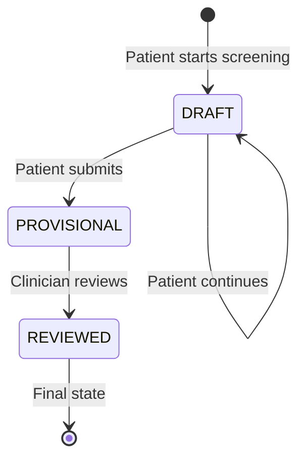

# SYSTEM OUTPUT STATUS MODEL
**Document Version:** 1.0  
**Effective Date:** 2026-02-14  
**Device:** Neurova Clinical Engine V1  
**Purpose:** Define report status model to avoid autonomous diagnostic classification

---

## 1. OVERVIEW

### 1.1 Purpose
Establish a clear status model for screening outputs that:
- Prevents autonomous diagnostic classification
- Requires professional clinical review
- Maintains regulatory compliance with intended use
- Provides clear visual indicators of review status

### 1.2 Regulatory Rationale
**Why This Exists:**
- Device is classified as screening tool, NOT diagnostic tool
- Autonomous diagnostic classification would change device classification
- Professional oversight required for all clinical interpretation
- Clear status model prevents misuse as autonomous diagnostic system

---

## 2. STATUS DEFINITIONS

### STATUS 1: DRAFT

**Definition:** Screening in progress, not yet submitted by patient.

**Characteristics:**
- Patient has started but not completed screening
- Responses partially saved
- No scores calculated
- Not visible to clinician

**Allowed Transitions:**
- DRAFT → DRAFT (patient continues answering)
- DRAFT → PROVISIONAL (patient submits completed screening)

**Visual Indicators:**
- Not displayed to clinician (patient-only view)
- Progress indicator shows completion percentage

**System Behavior:**
- Auto-save after each question
- Can resume within 24 hours
- Automatically deleted if not completed within 7 days

---

### STATUS 2: PROVISIONAL (Screening Only)

**Definition:** Screening complete, awaiting clinical review OR contains CRITICAL red flag.

**Characteristics:**
- Patient has submitted all responses
- Scores calculated and displayed
- Labeled as "Screening Summary"
- Requires clinician review before REVIEWED status

**Mandatory Conditions for PROVISIONAL:**
- Any CRITICAL red flag detected (e.g., PHQ-9 Q9 ≥1)
- Screening completed but not yet reviewed by clinician
- Default status for all completed screenings

**Allowed Transitions:**
- PROVISIONAL → REVIEWED (clinician marks as reviewed)
- PROVISIONAL → PROVISIONAL (remains until clinician review)

**Visual Indicators:**
- **Watermark:** "PROVISIONAL – NOT CLINICALLY REVIEWED" (diagonal, semi-transparent)
- **Header:** "Screening Summary – Requires Clinical Review"
- **Red Flags:** Highlighted in red, bold text
- **Status Badge:** Orange "PROVISIONAL" badge

**System Behavior:**
- PDF includes watermark on all pages
- Clinician notified of completed screening
- CRITICAL flags highlighted prominently
- Cannot be auto-promoted to REVIEWED

**Critical Rule:**
> [!CAUTION]
> **Any CRITICAL red flag MUST default to PROVISIONAL status.**
> 
> The system is PROHIBITED from automatically setting REVIEWED status if CRITICAL flags are present. Only explicit clinician action can transition to REVIEWED.

---

### STATUS 3: REVIEWED (Clinician Reviewed)

**Definition:** Clinician has reviewed screening summary and marked as reviewed.

**Characteristics:**
- Clinician has accessed and reviewed report
- Clinician has explicitly marked as reviewed
- Clinical interpretation completed (outside system)
- Screening results integrated into clinical assessment

**Allowed Transitions:**
- REVIEWED → REVIEWED (final state, no further transitions)

**Visual Indicators:**
- **No Watermark:** Watermark removed
- **Header:** "Screening Summary – Clinician Reviewed"
- **Status Badge:** Green "REVIEWED" badge
- **Review Metadata:** Clinician name, review timestamp displayed

**System Behavior:**
- Audit log records review event
- PDF generated without watermark
- Review timestamp permanently recorded
- Cannot be reverted to PROVISIONAL (immutable)

**Requirements for REVIEWED Status:**
- Clinician must be logged in (authenticated)
- Clinician must have appropriate role (licensed professional)
- Explicit "Mark as Reviewed" action required
- Audit log entry created

---

## 3. STATUS TRANSITION RULES

### 3.1 Allowed Transitions



### 3.2 Prohibited Transitions

❌ **DRAFT → REVIEWED** (cannot skip PROVISIONAL)  
❌ **PROVISIONAL → DRAFT** (cannot revert after submission)  
❌ **REVIEWED → PROVISIONAL** (cannot un-review)  
❌ **REVIEWED → DRAFT** (cannot revert to draft)

### 3.3 Automatic Transitions

**Allowed:**
- ✅ DRAFT → PROVISIONAL (upon patient submission)

**Prohibited:**
- ❌ PROVISIONAL → REVIEWED (requires explicit clinician action)
- ❌ Any automatic promotion to REVIEWED status

---

## 4. DATABASE IMPLEMENTATION

### 4.1 Database Field

**Table:** `ClinicalOrder`  
**Field:** `report_status`  
**Type:** `VARCHAR(20)`  
**Constraint:** `CHECK (report_status IN ('DRAFT', 'PROVISIONAL', 'REVIEWED'))`

**Additional Fields:**
```python
class ClinicalOrder(models.Model):
    report_status = CharField(
        max_length=20,
        choices=[
            ('DRAFT', 'Draft'),
            ('PROVISIONAL', 'Provisional'),
            ('REVIEWED', 'Reviewed'),
        ],
        default='DRAFT'
    )
    reviewed_by = ForeignKey(User, null=True, blank=True)
    reviewed_at = DateTimeField(null=True, blank=True)
    has_critical_flags = BooleanField(default=False)
```

### 4.2 Status Enforcement Logic

**Business Rules (Code):**
```python
def transition_to_provisional(order):
    """Patient submits screening."""
    if order.report_status != 'DRAFT':
        raise InvalidTransition("Can only transition from DRAFT")
    
    order.report_status = 'PROVISIONAL'
    order.save()
    audit_log('STATUS_CHANGED', order, 'DRAFT -> PROVISIONAL')

def transition_to_reviewed(order, clinician):
    """Clinician marks as reviewed."""
    if order.report_status != 'PROVISIONAL':
        raise InvalidTransition("Can only transition from PROVISIONAL")
    
    if not clinician.is_licensed_professional():
        raise PermissionDenied("Only licensed professionals can review")
    
    order.report_status = 'REVIEWED'
    order.reviewed_by = clinician
    order.reviewed_at = timezone.now()
    order.save()
    audit_log('STATUS_CHANGED', order, 'PROVISIONAL -> REVIEWED', clinician)
```

---

## 5. WATERMARKING SYSTEM

### 5.1 Watermark Application Rules

**Apply Watermark When:**
- ✅ `report_status == 'PROVISIONAL'`
- ✅ `has_critical_flags == True` (even if reviewed)

**Do NOT Apply Watermark When:**
- ✅ `report_status == 'REVIEWED'` AND `has_critical_flags == False`

### 5.2 Watermark Specifications

**Text:** "PROVISIONAL – NOT CLINICALLY REVIEWED"  
**Font:** Helvetica Bold, 48pt  
**Color:** Red, 30% opacity  
**Angle:** 45 degrees (diagonal)  
**Position:** Center of page  
**Pages:** All pages

**Implementation:**
```python
def apply_watermark(pdf_canvas, status, has_critical_flags):
    if status == 'PROVISIONAL' or has_critical_flags:
        pdf_canvas.saveState()
        pdf_canvas.setFont("Helvetica-Bold", 48)
        pdf_canvas.setFillColorRGB(1, 0, 0, alpha=0.3)
        pdf_canvas.rotate(45)
        pdf_canvas.drawCentredString(
            x=300, y=400,
            text="PROVISIONAL – NOT CLINICALLY REVIEWED"
        )
        pdf_canvas.restoreState()
```

---

## 6. USER INTERFACE REQUIREMENTS

### 6.1 Status Display (Clinician Portal)

**Order List View:**
| Order ID | Patient | Instrument | Status | Red Flags | Actions |
|----------|---------|------------|--------|-----------|---------|
| #12345 | John D. | PHQ-9 | 🟠 PROVISIONAL | ⚠️ CRITICAL | [Review] |
| #12346 | Jane S. | GAD-7 | 🟢 REVIEWED | None | [View] |

**Status Badge Colors:**
- 🔵 DRAFT: Blue
- 🟠 PROVISIONAL: Orange
- 🟢 REVIEWED: Green

### 6.2 Report View (Clinician)

**PROVISIONAL Status:**
```
┌─────────────────────────────────────────────┐
│ 🟠 PROVISIONAL – REQUIRES CLINICAL REVIEW   │
├─────────────────────────────────────────────┤
│ SCREENING SUMMARY                           │
│                                             │
│ ⚠️ CRITICAL FLAGS DETECTED                  │
│ • PHQ-9 Q9: Suicidal ideation (Score: 2)   │
│                                             │
│ [Mark as Reviewed]                          │
└─────────────────────────────────────────────┘
```

**REVIEWED Status:**
```
┌─────────────────────────────────────────────┐
│ 🟢 REVIEWED                                 │
│ Reviewed by: Dr. Smith                      │
│ Reviewed on: 2026-02-14 10:30 AM           │
├─────────────────────────────────────────────┤
│ SCREENING SUMMARY                           │
│                                             │
│ [Download PDF]                              │
└─────────────────────────────────────────────┘
```

---

## 7. AUDIT LOGGING

### 7.1 Status Change Events

**Event Type:** `STATUS_CHANGED`

**Logged Data:**
- Order ID
- Previous status
- New status
- User who triggered change (patient or clinician)
- Timestamp
- IP address

**Example:**
```json
{
  "event_type": "STATUS_CHANGED",
  "order_id": "12345",
  "previous_status": "PROVISIONAL",
  "new_status": "REVIEWED",
  "user_id": "clinician_456",
  "timestamp": "2026-02-14T10:30:00Z",
  "ip_address": "192.168.1.100"
}
```

---

## 8. VALIDATION AND TESTING

### 8.1 Status Transition Tests

**Test Case 1: DRAFT → PROVISIONAL**
- **Setup:** Create order in DRAFT status
- **Action:** Patient submits screening
- **Expected:** Status changes to PROVISIONAL
- **Verify:** Audit log entry created

**Test Case 2: PROVISIONAL → REVIEWED**
- **Setup:** Create order in PROVISIONAL status
- **Action:** Clinician marks as reviewed
- **Expected:** Status changes to REVIEWED, reviewed_by and reviewed_at set
- **Verify:** Audit log entry created

**Test Case 3: CRITICAL Flag Enforcement**
- **Setup:** Patient submits screening with PHQ-9 Q9 = 2
- **Action:** System calculates scores
- **Expected:** Status set to PROVISIONAL, has_critical_flags = True
- **Verify:** Cannot auto-promote to REVIEWED

**Test Case 4: Watermark Application**
- **Setup:** Generate PDF for PROVISIONAL report
- **Action:** Download PDF
- **Expected:** Watermark present on all pages
- **Verify:** Visual inspection

**Test Case 5: No Auto-Promotion**
- **Setup:** Create order in PROVISIONAL status
- **Action:** Wait 24 hours (no clinician action)
- **Expected:** Status remains PROVISIONAL
- **Verify:** No automatic transition to REVIEWED

---

## 9. COMPLIANCE VERIFICATION

### 9.1 Regulatory Requirements

| Requirement | Implementation | Verification |
|-------------|----------------|--------------|
| No autonomous diagnosis | PROVISIONAL status requires clinician review | Status transition tests |
| Professional oversight | Only clinicians can set REVIEWED | Permission tests |
| Clear labeling | "Screening Summary" header | UI inspection |
| Red flag escalation | CRITICAL flags default to PROVISIONAL | Red flag tests |
| Audit trail | All status changes logged | Audit log review |

### 9.2 Intended Use Alignment

✅ **Device is screening tool only:** Status model enforces professional review  
✅ **Does not diagnose:** No automatic diagnostic classification  
✅ **Does not autonomously interpret:** REVIEWED requires human action  
✅ **Requires professional oversight:** Clinician review mandatory

---

## 10. FUTURE CONSIDERATIONS

### 10.1 Prohibited Enhancements

❌ **Automatic REVIEWED Status:** Never implement auto-promotion based on time or score  
❌ **AI-Based Review:** No automated clinical interpretation  
❌ **Risk Stratification:** No automatic patient risk categorization beyond validated severity bands  
❌ **Treatment Recommendations:** No status-based treatment suggestions

### 10.2 Allowed Enhancements

✅ **Notification Improvements:** Better clinician alerts for PROVISIONAL reports  
✅ **Workflow Optimization:** Batch review interface for multiple reports  
✅ **Reporting:** Analytics on average time-to-review  
✅ **Audit Enhancements:** More detailed audit logging

---

## DOCUMENT CONTROL

**Prepared By:** Regulatory Affairs / Software Engineering  
**Reviewed By:** [To be completed]  
**Approved By:** [To be completed]  
**Effective Date:** 2026-02-14  
**Next Review:** 2027-02-14

---

**END OF DOCUMENT**
